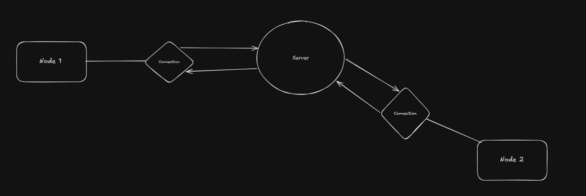

# BROADCAST-SERVER

The program works over a centralized server. Many users can connect to the server and send messages. A message sent by one of the users will
be propagated to every user connected to the server.

## CHALLENGES

The server must deal concurrently with multiple connections and handle shutdown gracefully from both sides(server and client).
Beyond that, there is also the communication pattern which adds the challenge to implement communication similar to a notification
service.

## VISUALIZATION

